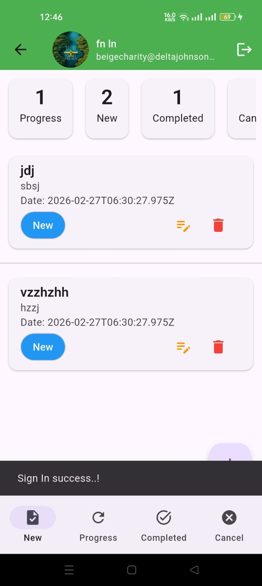

# Task Manager 📝

A comprehensive and intuitive Task Manager application built with Flutter. This tool helps you organize your daily tasks efficiently, featuring a clean UI, secure authentication, and robust state management.

## 🌟 Features

- **User Authentication**: Secure login and OTP verification.
- **Task Management**: Create, read, update, and delete tasks effectively.
- **State Management**: Optimized with `Provider` for smooth and responsive performance.
- **Local Storage**: Preferences and user session handled seamlessly using `shared_preferences`.
- **Image Handling**: Profile or task-related image uploads.
- **Responsive Design**: Adapts beautifully to modern mobile screens.

## 📸 Screenshots

Here is a glimpse of the application:

<p align="center">
  
  
</p>

## 🛠️ Technology Stack

- **Framework**: [Flutter](https://flutter.dev/)
- **State Management**: [Provider](https://pub.dev/packages/provider)
- **Networking**: [http](https://pub.dev/packages/http)
- **Authentication/Inputs**: [pin_code_fields](https://pub.dev/packages/pin_code_fields)
- **Local Data**: [shared_preferences](https://pub.dev/packages/shared_preferences)
- **Assets Support**: [flutter_svg](https://pub.dev/packages/flutter_svg)
- **Image Handling**: [image_picker](https://pub.dev/packages/image_picker), [image](https://pub.dev/packages/image)
- **Logging**: [logger](https://pub.dev/packages/logger)

## 🚀 Getting Started

Follow these instructions to get a copy of the project up and running on your local machine.

### Prerequisites

- [Flutter SDK](https://docs.flutter.dev/get-started/install) (`>=3.38.1`)
- [Dart SDK](https://dart.dev/get-dart) (`>=3.10.0 <4.0.0`)
- Android Studio / VS Code with Flutter & Dart extensions installed.

### Installation

1. **Clone the repository:**
   ```bash
   git https://github.com/margaretjconn528/task_manager.git
   ```

2. **Navigate to the project directory:**
   ```bash
   cd task_manager
   ```

3. **Install dependencies:**
   ```bash
   flutter pub get
   ```

4. **Run the app:**
   ```bash
   flutter run
   ```

## 🤝 Contributing

Contributions, issues, and feature requests are welcome! 

---

